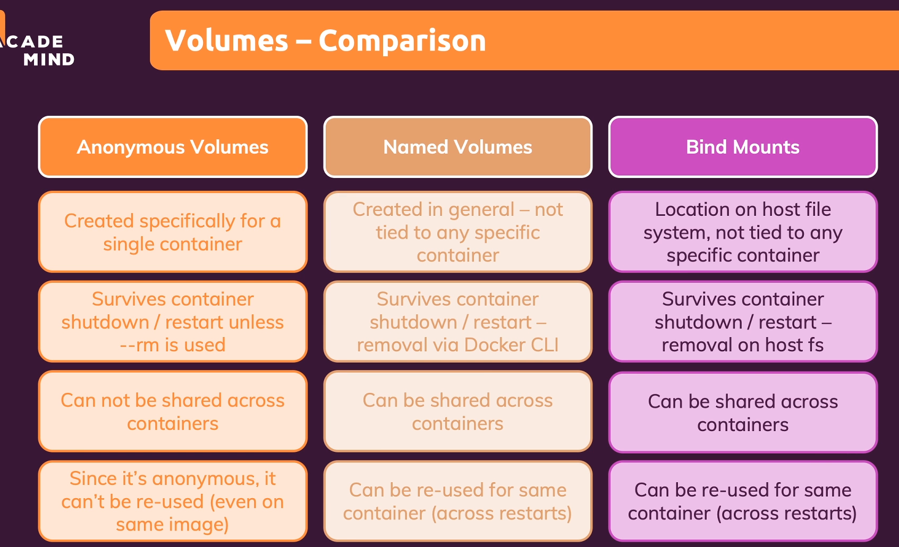

docker run -d -p 3000:80 --rm --name feedback-app -v feedback:/app/feedback feedback-node:volumes

docker run -d --rm -p 3000:80 --name feedback-app -v feedback:/app/feedback -v "C:\Users\User\Downloads\data-volumes-01-starting-setup\data-volumes-01-starting-setup:/app" -v /app/node_modules feedback-node:volumes

read only bind mount
docker run -d --rm -p 3000:80 --name feedback-app -v feedback:/app/feedback -v "C:\Users\User\Downloads\data-volumes-01-starting-setup\data-volumes-01-starting-setup:/app:ro" -v /app/temp -v /app/node_modules feedback-node:volumes